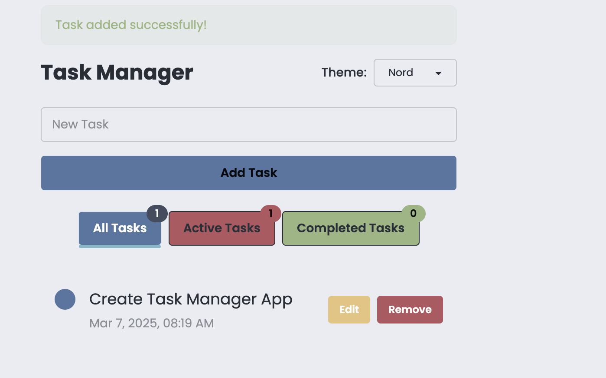

# 📝 Task Manager

[](https://reactjs.org/)
[](https://www.typescriptlang.org/)
[](LICENSE)

A modern, feature-rich task management application built with React and TypeScript. This application helps users organize their tasks efficiently with a clean, intuitive interface and powerful features.



## 📋 Table of Contents

- [📝 Task Manager](#-task-manager)
  - [📋 Table of Contents](#-table-of-contents)
  - [✨ Features](#-features)
  - [🛠️ Tech Stack](#️-tech-stack)
  - [🚀 Getting Started](#-getting-started)
    - [Prerequisites](#prerequisites)
    - [Installation](#installation)
  - [💡 Usage](#-usage)
  - [🤝 Contributing](#-contributing)
  - [📄 License](#-license)
  - [🙏 Acknowledgments](#-acknowledgments)

## ✨ Features

- ✅ Create, edit, and delete tasks
- 🔄 Mark tasks as complete/incomplete
- 🏷️ Filter tasks (All/Active/Completed)
- 🎨 Multiple theme options
- 📱 Responsive design
- ⏰ Timestamp tracking
- 💾 Local storage persistence
- ⌨️ Keyboard shortcuts
- 🌙 Dark/Light mode support

## 🛠️ Tech Stack

- **Frontend Framework:** React 19
- **Language:** TypeScript
- **Styling:**
  - TailwindCSS
  - DaisyUI components
- **Build Tool:** Vite
- **Routing:** React Router v7
- **Storage:** LocalStorage API
- **Testing:** Jest

## 🚀 Getting Started

### Prerequisites

- Node.js (v18 or higher)
- npm or yarn

### Installation

1. Clone the repository

```bash
git clone https://github.com/AndrewT-Tran/TaskManagerApp.git
cd task-manager
```

2. Install dependencies

```bash
npm install
# or
yarn install
```

3. Start the development server

```bash
npm run dev
# or
yarn dev
```

4. Open your browser and navigate to `http://localhost:5173`

## 💡 Usage

1. **Creating Tasks**
   - Click the "Add Task" button or press `Ctrl/Cmd + Enter`
   - Enter task details and click "Save"

2. **Managing Tasks**
   - Click the checkbox to mark tasks as complete
   - Use the edit button to modify task details
   - Click the delete button to remove tasks

3. **Filtering Tasks**
   - Use the filter buttons to view All/Active/Completed tasks
   - Search tasks using the search bar

4. **Customization**
   - Toggle between light/dark mode using the theme switcher
   - Choose from multiple color themes

## 🤝 Contributing

Contributions are welcome! Please feel free to submit a Pull Request.

1. Fork the repository
2. Create your feature branch (`git checkout -b feature/AmazingFeature`)
3. Commit your changes (`git commit -m 'Add some AmazingFeature'`)
4. Push to the branch (`git push origin feature/AmazingFeature`)
5. Open a Pull Request

## 📄 License

This project is licensed under the MIT License - see the [LICENSE](LICENSE) file for details.

## 🙏 Acknowledgments

- [React](https://reactjs.org/)
- [TypeScript](https://www.typescriptlang.org/)
- [TailwindCSS](https://tailwindcss.com/)
- [DaisyUI](https://daisyui.com/)
